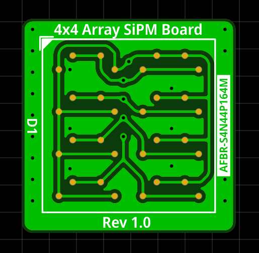
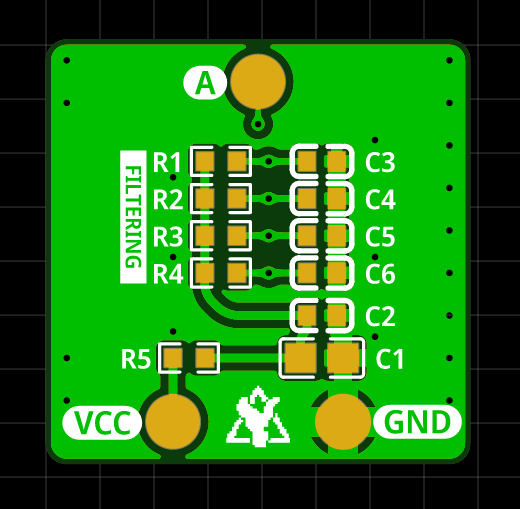
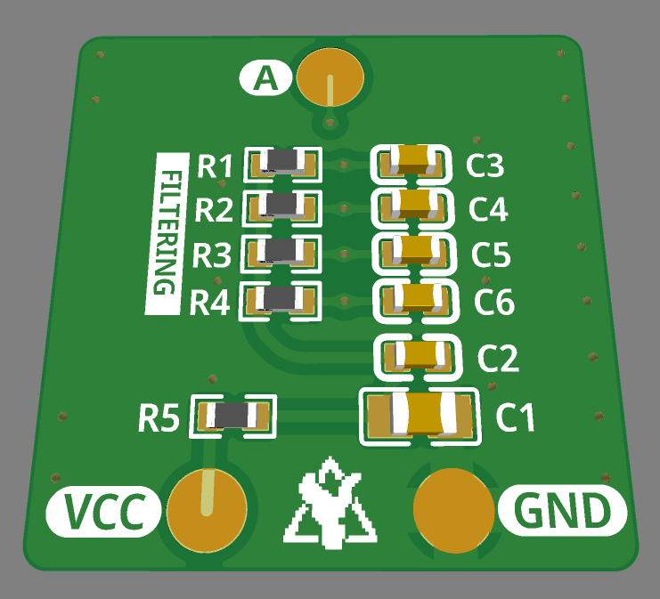

# AFBR SiPM Array Board

Carrier board for the AFBR-S4N44P164M SiPM: a 4 x 4 array of 4 mm silicon photomultipliers by [Broadcom / Avago](https://docs.broadcom.com/doc/AFBR-S4N44P164M-DS-4x4-NUV-MT-Silicon-Photo-Multiplier-Array).

PCB size is 20 x 20 mm and all the passive components on the back side are 0603 or larger in size for hand-soldering. Keep in mind, however, that the SiPM **cannot** be hand-soldered and has to be reflow-soldered instead since the pads are not accessible once the sensor is on the PCB.

  
  
  

On the front side there is only the sensor itself and all the other parts are on the back. This ensures good optical contact and light-tight sealing. The PCB includes some bias filtering for the SiPM array that must also be soldered for the board to work!

The SiPMs all share a common cathode with an R-C low-pass filter and some bulk decoupling and an additional R-C filter for each group of 4 individual SiPMs. All anodes are also connected together so that the 16 SiPMs act like a single large-size SiPM at the signal output.
